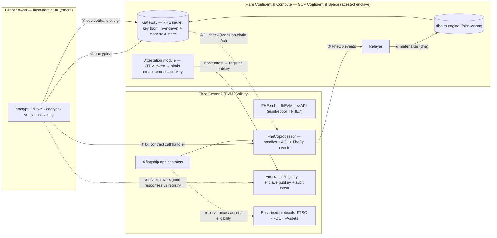

# fhish on Flare — Architecture

Port the **fhish** Fully Homomorphic Encryption module to **Flare Network** (EVM), and use
**Flare Confidential Compute** to remove FHE's single trust assumption. Target: **Flare Summer
Signal — Bounty 2, Confidential Compute Apps**.

Author: **nickthelegend** (original fhish author — we own every upstream repo we reuse).

---

## 0. Thesis

FHE gives **composable confidential compute** — `compare` / `select` / arbitrary functions over
encrypted data that many parties build on **without anyone decrypting**. Its one honest weakness is a
**trusted keyholder**: a gateway holds the FHE secret key ("trust me, I won't peek").

**Flare Confidential Compute** — realized today via **Google Cloud Confidential Space** (AMD SEV‑SNP +
vTPM attestation), the path Flare blesses through the **Flare AI Kit** — removes exactly that weakness:

- The gateway runs **inside an attested enclave**.
- The FHE secret key is **generated inside the enclave and never leaves**.
- The enclave's measured identity is **bound to its public key and registered on‑chain**, with the raw
  attestation emitted as an **on‑chain audit event**.

> **FHE for the compute, Flare's TEE for a keyholder nobody has to trust.**
> FHE and TEE are not competitors here — the TEE *decentralizes FHE's trust assumption*.

Why Flare is the natural home: **Flare is EVM‑compatible and fhish was originally an EVM/fhEVM module.**
This is a "return home" port — contracts go back to **Solidity** (forked from `fhish-contracts-v2`),
and Flare's confidential‑compute + enshrined data protocols (FTSO, FDC, FAssets) give the flagship
apps a *meaningful*, non‑cosmetic integration.

---

## 1. The fhish model (recap)

fhish is a **symbolic‑execution FHE coprocessor** (Zama's fhEVM design), split in two:

| Layer | Chain‑specific? | Responsibility |
|---|---|---|
| **On‑chain** | ✅ yes | Store 32‑byte **handles** + per‑account **ACL**; emit `FheOp` events. Does **no** FHE math (can't). |
| **Off‑chain coprocessor** | ❌ chain‑agnostic | Real Zama `tfhe-rs` engine + **gateway** (FHE secret key, ciphertext store, compute, decrypt) + **relayer** (events → materialize ciphertext) + **client SDK**. |

The Algorand→Stellar port rewrote only the 2 contracts and swapped the chain client; the off‑chain
coprocessor was reused as‑is. For Flare, the on‑chain layer goes **back to the original EVM Solidity**
and the off‑chain layer is reused **and moved inside a TEE**.

---

## 2. Decisions (locked)

| # | Decision | Choice |
|---|---|---|
| 1 | Bounty | **B2 — Confidential Compute** |
| 2 | TEE integration | **Yes** — gateway runs in an attested enclave |
| 3 | Attestation model | **Enclave‑bound key**: verify‑then‑register the enclave pubkey on‑chain + emit attestation as an audit event |
| 4 | TEE substrate | **Google Cloud Confidential Space** (Flare‑blessed via Flare AI Kit) |
| 5 | TEE sequencing | **Sim‑attestation dev‑mode first**, then **one** real Confidential Space deploy (GCP $300 free trial) for the demo |
| 6 | Network | **Coston2 testnet** — chainId **114**, RPC `https://coston2-api.flare.network/ext/C/rpc` |
| 7 | Contract base | **Fork the original EVM `fhish-contracts-v2`** (not the Stellar Rust rewrite) |
| 8 | Deliverable | **Library + 4 flagship apps + examples** |
| 9 | Flagship apps | Sealed‑bid auction @ FTSO · Confidential token · Confidential voting/DAO · Confidential FAsset balance |
| 10 | Repo | **Monorepo** `fhish-flare` now; split to `fhish-flare` + `fhish-examples-flare` at publish |
| 11 | Intensity | **Full‑time sprint** to **Aug 14** deadline |

---

## 3. System architecture



### 3.1 On‑chain (Solidity, Coston2 — forked from `fhish-contracts-v2`)

- **`FHE.sol`** — the fhEVM‑style **developer library** (the "production‑grade FHE library like Zama /
  Fhenix"): encrypted types `ebool, euint8/16/32/64` and ops `TFHE.add/sub/mul/min/max/eq/ne/lt/le/gt/ge/select/asEuint/allow/…`.
  Handles are `bytes32`, computed deterministically; each op emits an `FheOp` event. **No FHE math runs
  on‑chain** — the contract manipulates handles and ACLs only.
- **`FheCoprocessor`** — handle registry, per‑handle/per‑address **ACL** (`allow`, `isAllowed`), and the
  op surface (`trivialEncrypt`, `verifyInput`, `fheAdd/…`, `select`).
- **`AttestationRegistry`** *(new for Flare)* — `registerEnclave(pubkey, attestationToken, measurement)`
  (**verify‑then‑register**: an off‑chain verifier validates the Confidential Space token, then submits
  the pubkey), stores the active enclave pubkey(s), and **emits `EnclaveAttested(token, measurement,
  pubkey)`** as a permanent on‑chain audit trail. The SDK verifies that gateway responses are signed by
  a registered enclave key.
- **4 flagship app contracts** (§4), each wired to an enshrined Flare protocol where it adds real value.

### 3.2 Off‑chain coprocessor (chain‑agnostic — reused, moved **inside** the TEE)

Reused from `fhish-coprocessor` / `fhish-gateway` / `fhish-wasm` / `fhish-relayer-v2`:

- **fhe‑engine** — real homomorphic math via Zama `tfhe-rs` (vendored `fhish-wasm`).
- **gateway** — FHE secret key (**generated in‑enclave**), ciphertext store, compute, and
  **ACL‑gated decrypt**.
- **relayer** — watches Coston2 logs (ethers `getLogs`) for `FheOp` / `TrivialEncrypt` → materializes
  the real ciphertext into the gateway.
- **attestation module** *(new)* — on boot: generate the enclave keypair, obtain the Confidential Space
  **vTPM attestation token** binding `measurement → pubkey`, expose it to the registrar. **Sim‑mode**
  emits a correctly‑shaped fake token for local dev (no GCP needed).

### 3.3 Client SDK (`fhish-sdk-v2`, adapted to Flare/ethers)

`encrypt(v)` (upload ciphertext to gateway) · build/sign/send Coston2 tx via **ethers** · `decrypt(handle,
signer)` (gateway checks the on‑chain `Acl` entry, returns the plaintext) · **verify enclave signatures**
against `AttestationRegistry`.

### 3.4 Flare integration hooks (per flagship app — see §4)

FTSO price feeds, FAssets (FXRP), and (optionally) FDC `Web2Json` — used where they add real value, not
as decoration.

---

## 4. Flagship apps (all four)

| App | FHE core | Flare hook | Why it matters |
|---|---|---|---|
| **Sealed‑bid auction** | encrypted bids; homomorphic `max`/`compare` to pick the winner; only the result is revealed | **FTSO** live price as reserve / settlement price | Showcases FHE's real edge (compute, not payments) + an enshrined oracle |
| **Confidential token** | fhEVM encrypted ERC‑20: `mint` + `transfer` via homomorphic `min`/`sub`/`add`; balances never on‑chain | baseline | Direct reuse of the proven port logic; the canonical fhish demo |
| **Confidential voting / DAO** | encrypted votes tallied homomorphically; revealed only at close | **FDC** *(optional)* to attest an off‑chain eligibility snapshot | Classic confidential‑compute use case, clean story |
| **Confidential FAsset balance** | private balances over a bridged asset | **FAssets (FXRP)** | Ties confidential compute to Flare's core asset thesis (touches B1 too) |

Plus the **10 ported examples** (from `fhish-examples-stellar`, re‑targeted to Coston2) as breadth with
on‑chain tx proofs.

---

## 5. Trust model (honest)

**What the TEE buys us**
- The keyholder **cannot exfiltrate the FHE secret key** or observe plaintext — it lives in encrypted
  enclave memory, isolated from the host OS, hypervisor, and cloud admin.
- The enclave **code is measured and attested**; the measurement is bound to the pubkey on‑chain.
- A **permanent on‑chain audit trail** (`EnclaveAttested`) of exactly which enclave holds the key.
- ⇒ fhish's *"trust me, I won't peek"* becomes *"hardware says it can't peek, and here's the proof."*

**Residual trust (disclosed)**
- Hardware root of trust: AMD SEV‑SNP + Google's attestation service.
- **Single enclave** — no threshold/MPC KMS yet (roadmap).
- **Input‑proof** argument is still a pass‑through (matches upstream fhish).
- v1 registration is **verify‑then‑register** (off‑chain verifier + on‑chain audit event); **full
  on‑chain attestation verification** is a post‑hackathon upgrade.
- FHE ops are ~11–25 s in wasm — production needs a native `tfhe-rs` build, a job queue, and a durable
  ciphertext store.

Everything above is stated plainly in the submission — judges reward honesty about the trust boundary.

---

## 6. Reuse map — clone/fork vs build‑new

**Fork / reuse (yours, all public under `fhish-tech`):**
- `fhish-contracts-v2` → `contracts/` (Solidity `FHE.sol` + coprocessor + ACL + confidential token)
- `fhish-coprocessor` + `fhish-gateway` + `fhish-wasm` → `offchain/` (real‑tfhe engine, chain‑agnostic)
- `fhish-sdk-v2` → client SDK · `fhish-relayer-v2` → events/relayer · `fhish-hardhat-plugin` → EVM tooling
- `fhish-examples-stellar` → example set to re‑target

**Build new for Flare:**
- `AttestationRegistry.sol` + the enclave **attestation module** + **Confidential Space image** + **sim‑mode**
- Chain‑client swap → **ethers + Coston2**
- **4 flagship app contracts** + their **FTSO / FAssets / FDC** hooks
- Ported examples, demo video, submission writeup

---

## 7. Repo layout (monorepo)

```
fhish-flare/
├── contracts/     Solidity — fork of fhish-contracts-v2 + AttestationRegistry + 4 app contracts (Hardhat + Foundry)
├── offchain/      coprocessor + gateway + relayer + SDK + vendor/fhish-wasm + attestation + sim-mode
├── tee/           Confidential Space container image, cloudbuild, attestation verifier
├── examples/      10 ported examples + 4 flagship demos (Coston2 tx proofs)
├── docs/          ARCHITECTURE.md (this) · ROADMAP.md · diagrams
└── .secrets/      Coston2 deployer key (gitignored)
```

---

## 8. Environment (locked)

- **Network:** Coston2 · chainId **114** · RPC `https://coston2-api.flare.network/ext/C/rpc` ·
  explorer `https://coston2-explorer.flare.network`
- **Deployer wallet:** `0xcB0E9b163ED920398f301f289a11922dAB704941` (key in `.secrets/coston2-deployer.json`,
  gitignored) — **needs C2FLR faucet funding** before deploy.
- **Toolchain:** Foundry (`forge`/`cast`) + `fhish-hardhat-plugin`; Node 25; Zama `tfhe` via vendored
  `fhish-wasm`. GCP Confidential Space for the real TEE deploy.
